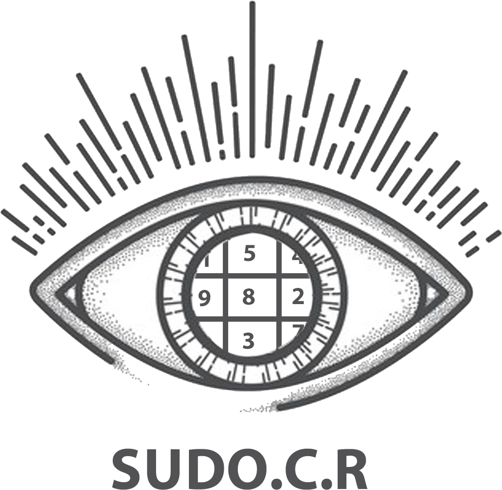
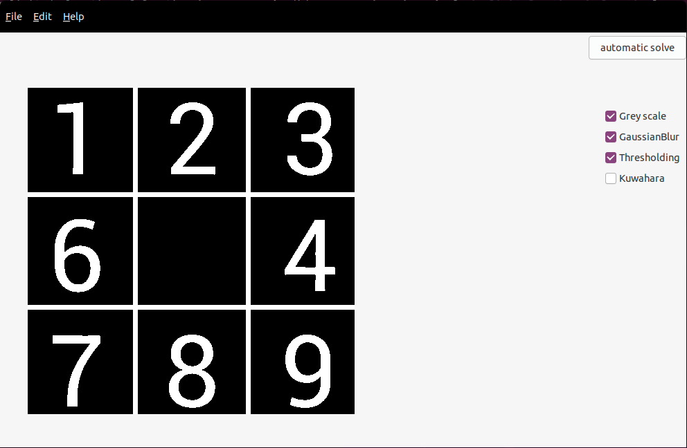

# SUDO.C.R - EPITA S3 Project

This is project is an OCR wich could recognize and resolves SUDOKU.

## Usage

## User Interface
We are making a User Interface, to give a better usage of our tool.

